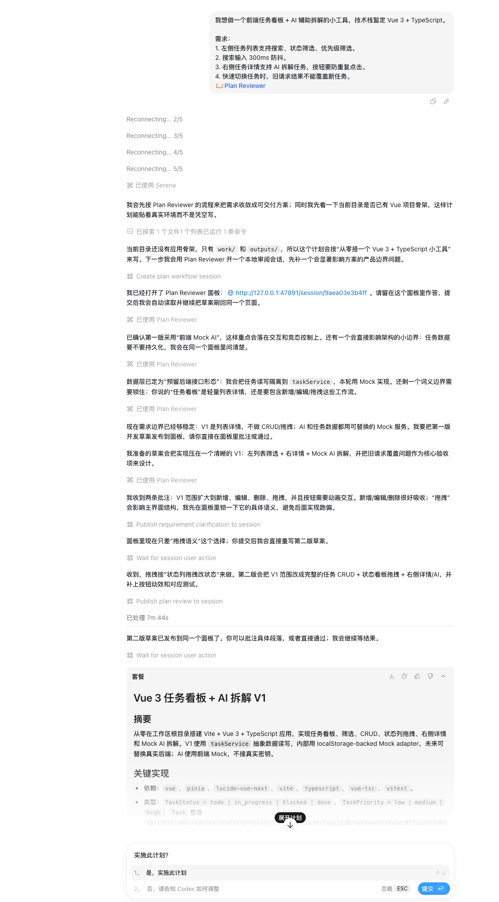
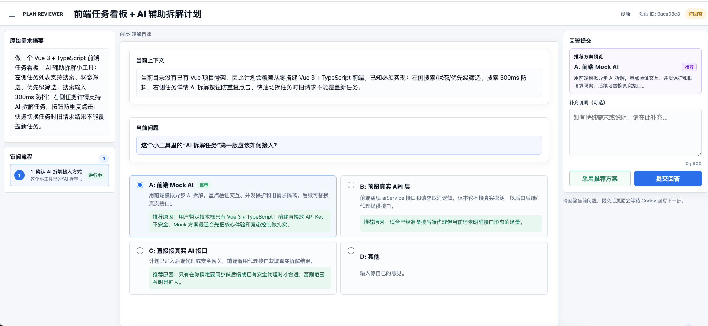
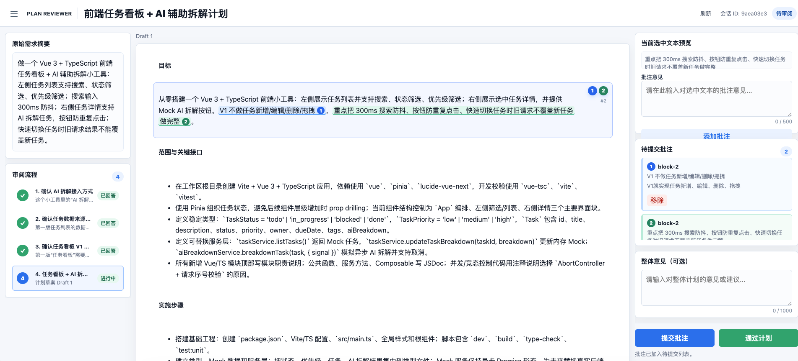

# Plan Reviewer

Plan Reviewer 是一个本地 Codex 插件，用来在正式 Plan 输出前完成需求澄清、计划草案审阅和批注迭代。它会启动只绑定 `127.0.0.1` 的本地面板，让用户在同一个 Session 页面里回答澄清问题、批注 Markdown 计划草案，并等待 Codex 自动回写下一版内容。

## 适用场景

- 你希望 Codex 在正式 Plan 前先确认需求，而不是直接开始写代码。
- 你希望 Codex 一次只问一个澄清问题，并在达到较高理解信心后再生成方案。
- 你希望像审阅文档一样标注计划草案中的不合理段落。
- 你希望提交回答或批注后继续停留在面板中，等待 Codex 自动刷新下一步。

## 核心能力

- 持续工作流 Session：需求澄清、计划审阅、等待 Codex 回写都在同一个 `/session/{id}` 面板中完成。
- 需求澄清：支持 A/B/C 选项、推荐方案、D: 其他输入，以及补充说明。
- 计划批注：支持点击段落或选中文本后添加批注，并用不同背景标记已批注区域。
- 等待态：用户提交后页面会进入等待 Codex 回写状态，保留最近提交摘要。
- 本地优先：面板只绑定 `127.0.0.1`，不引用外部脚本、字体或远程服务。
- 历史清理：支持通过 MCP 工具裁剪或清空本地审阅记录。

## 平台支持

| 平台 | 状态 | 说明 |
| --- | --- | --- |
| macOS | 已验证 | 默认 `.mcp.json` 使用 `python3` 启动。 |
| Linux | 理论支持 | 需要可用的 `python3` 与本地浏览器。 |
| Windows | 实验性支持 | 使用 `.mcp.windows.json`，默认通过 Python Launcher `py -3` 启动。 |

## 效果预览

### 整体工作台



### 关键状态

| 提问 | 需求澄清 |
| --- | --- |
|  |  |

| 方案批注 | 等待 Codex 回写 |
| --- | --- |
|  |  |

## 仓库结构

```text
.
├── .codex-plugin/plugin.json     # Codex 插件 manifest
├── .mcp.json                     # MCP server 配置
├── .mcp.windows.json             # Windows MCP server 配置示例
├── assets/panel/                 # 本地审阅面板 HTML/CSS/JS
├── docs/images/                  # README 效果截图
├── scripts/plan_reviewer_mcp.py  # MCP server 与本地 HTTP 面板
└── skills/plan-reviewer/         # Codex 使用本插件时的工作流说明
```

## 安装

> 说明：Codex 插件生态仍在快速变化中。下面以本地 personal plugin 安装为主；如果你的 Codex 版本安装命令不同，请以当前 Codex 文档或 `codex plugin --help` 为准。

### macOS / Linux

1. 克隆仓库到本地插件目录：

```bash
mkdir -p ~/plugins
git clone https://github.com/Mr-CTao/codex-plan-reviewer.git ~/plugins/plan-reviewer
```

2. 确认 personal marketplace 中存在插件入口。

如果你已经有 `~/.agents/plugins/marketplace.json`，确保其中包含类似配置：

```json
{
  "name": "plan-reviewer",
  "source": {
    "source": "local",
    "path": "./plugins/plan-reviewer"
  },
  "policy": {
    "installation": "AVAILABLE",
    "authentication": "ON_INSTALL"
  },
  "category": "Productivity"
}
```

3. 安装插件：

```bash
codex plugin add plan-reviewer@personal
```

4. 新开一个 Codex 线程或重启 Codex，确保 MCP 工具被重新加载。

### Windows

1. 确认安装 Python 3，并优先启用 Python Launcher。

```powershell
py -3 --version
```

如果 `py` 不可用，但 `python --version` 可用，可以把 `.mcp.windows.json` 里的 `"command": "py"` 改成 `"command": "python"`，并移除 `"-3"` 参数。

2. 克隆仓库到 Windows 用户插件目录：

```powershell
New-Item -ItemType Directory -Force "$env:USERPROFILE\plugins" | Out-Null
git clone https://github.com/Mr-CTao/codex-plan-reviewer.git "$env:USERPROFILE\plugins\plan-reviewer"
Set-Location "$env:USERPROFILE\plugins\plan-reviewer"
```

3. 使用 Windows MCP 配置覆盖默认配置：

```powershell
Copy-Item .mcp.windows.json .mcp.json -Force
```

4. 确认 personal marketplace 中存在插件入口。

Windows 默认路径通常是：

```text
%USERPROFILE%\.agents\plugins\marketplace.json
```

其中插件 source path 仍建议写成相对路径：

```json
{
  "name": "plan-reviewer",
  "source": {
    "source": "local",
    "path": "./plugins/plan-reviewer"
  },
  "policy": {
    "installation": "AVAILABLE",
    "authentication": "ON_INSTALL"
  },
  "category": "Productivity"
}
```

5. 安装插件：

```powershell
codex plugin add plan-reviewer@personal
```

6. 新开一个 Codex 线程或重启 Codex，确保 MCP 工具被重新加载。

## 使用方式

在 Codex 中选择 Plan Reviewer 的默认 Prompt 后，只需要输入真实任务内容即可，例如：

```text
测试任务：
我想做一个前端任务看板 + AI 辅助拆解的小工具，技术栈暂定 Vue 3 + TypeScript。

需求：
1. 左侧任务列表支持搜索、状态筛选、优先级筛选。
2. 搜索输入 300ms 防抖。
3. 右侧任务详情支持 AI 拆解任务，按钮要防重复点击。
4. 快速切换任务时，旧请求结果不能覆盖新任务。
```

插件会引导 Codex 执行以下流程：

1. 创建一个持续工作流 Session 面板。
2. 信息不足时，先在面板中一次询问一个澄清问题。
3. 达到约 95% 理解信心后，发布 Markdown 计划草案。
4. 用户在面板中添加批注或通过计划。
5. Codex 读取面板结果并回写下一版内容。
6. 用户通过后，Codex 再输出正式 Plan。

## 本地验证

macOS / Linux:

运行普通计划审阅 demo：

```bash
python3 scripts/plan_reviewer_mcp.py --serve-only --demo
```

运行持续工作流 demo：

```bash
python3 scripts/plan_reviewer_mcp.py --serve-only --session-demo
```

运行需求澄清 demo：

```bash
python3 scripts/plan_reviewer_mcp.py --serve-only --clarify-demo
```

语法检查：

```bash
node --check assets/panel/app.js
node --check assets/panel/clarify.js
node --check assets/panel/session.js
python3 -m py_compile scripts/plan_reviewer_mcp.py
```

插件 manifest 校验可以使用 Codex 的插件创建辅助脚本：

```bash
python3 ~/.codex/skills/.system/plugin-creator/scripts/validate_plugin.py ~/plugins/plan-reviewer
```

Windows PowerShell:

```powershell
py -3 .\scripts\plan_reviewer_mcp.py --serve-only --demo
py -3 .\scripts\plan_reviewer_mcp.py --serve-only --session-demo
py -3 .\scripts\plan_reviewer_mcp.py --serve-only --clarify-demo
py -3 -m py_compile .\scripts\plan_reviewer_mcp.py
```

## 状态文件与隐私

审阅记录默认保存在：

```text
~/.codex/plan-reviewer/reviews.json
```

Windows 下对应路径通常是：

```text
%USERPROFILE%\.codex\plan-reviewer\reviews.json
```

这些记录只用于本地批注循环，不应提交到 Git，也不应该写入密钥、Token、生产密码或其他敏感信息。插件会使用 `reviews.lock` 保护跨进程写入，降低 MCP、CLI 兜底和旧面板进程同时写入时丢批注的风险。

可以通过 MCP 工具清理历史：

- `prune_plan_reviews`：保留每类近期记录，并清理较旧且已完成的审阅、澄清和 Session；默认不会删除 pending/未完成 Session。
- `clear_plan_reviews`：清空已完成的审阅、澄清和 Session，需要显式确认；如需连同 pending/未完成 Session 一并删除，传入 `include_pending: true`。

## MCP 工具缺失时

如果当前 Codex 线程能看到 Plan Reviewer 技能说明，但没有自动加载 MCP 工具，通常是该线程启动时插件工具没有进入当前工具列表。建议：

1. 新开 Codex 线程或重启 Codex。
2. 确认 personal marketplace 中仍包含 `plan-reviewer` 入口，且插件路径指向当前源码目录。
3. 使用 README 中的本地 demo 命令确认脚本可以启动。

## 开源边界

建议提交到仓库的内容：

- `.codex-plugin/plugin.json`
- `.mcp.json`
- `.mcp.windows.json`
- `assets/`
- `docs/images/`
- `scripts/`
- `skills/`
- `README.md`
- `LICENSE`
- `CONTRIBUTING.md`
- `CHANGELOG.md`

不建议提交：

- `.serena/`
- `.playwright-cli/`
- `__pycache__/`
- `.codex/`
- `reviews.json`
- `reviews.lock`
- 本地日志、截图、临时输出和任何密钥文件

## 贡献

欢迎提交 issue 或 pull request。为了保持插件可靠，请在提交 PR 前至少运行 README 中的语法检查，并确认本地 demo 面板能正常打开。

## 许可证

本项目使用 [MIT License](LICENSE)。
